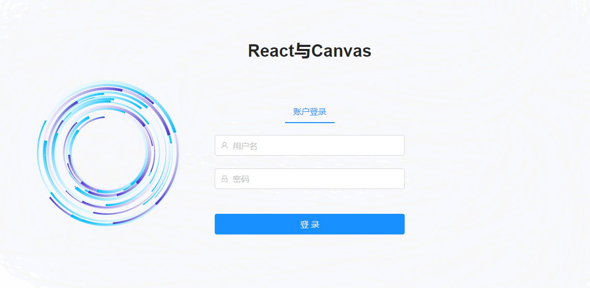

### React与Canvas

> 在首页或者登录页面，使用canvas制作动态背景

* 类似于下面的界面，登录页面悬浮在canvas动画背景上面




* 1 先写登录静态页面
* 2 将canvas写在页面内容的前面

```
<div className={styles.container}>
    <canvas/>
    <div className={styles.content}>
        <div className={styles.top}>
            <span className={styles.title}>React与Canvas</span>
        </div>
        <UserName placeholder="用户名"/>
        <Password placeholder="密码" />
    </div>
</div>
```

* 3 在组件内部初始化画布，并将画布设置为绝对定位，使得页面内容悬浮于canvas上

> ① 在 componentDidMount 钩子函数里初始化
>
> ② 设置画布为绝对定位 **canvas.style = 'position:absolute;background:gainsboro;';**

```
// c 是全局变量
componentDidMount(){
    let canvas = document.querySelector('canvas');
    c = canvas.getContext('2d');

    canvas.width = window.innerWidth;
    canvas.height = window.innerHeight;
    canvas.style = 'position:absolute;background:gainsboro;';
    
    window.addEventListener('resize',function(){
        canvas.width = window.innerWidth;
        canvas.height = window.innerHeight;
    });

    window.addEventListener('mousemove',(mouse)=>{
        mousePosition.x = mouse.x;
        mousePosition.y = mouse.y;
    });
    init();
    animate();
}
```

