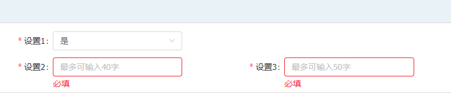

###  表单相互影响

> 1 表单之间影响验证

例如下图



需求是，设置1为是时，设置2和设置3必填，为否时，不必填

现在出现一种情况，设置1为是，然后设置2和设置3填了数据后又都清空，

此时设置设置2和设置3验证“必填”，

此时将设置1改为否时，虽然设置2和设置3前面的红星没有了（通过state来控制），

但是，“必填”二字还存在

**----------解决方案------------**

获取设置2和设置3的值，又重新赋给自己

```
changeOneStatus = (value) => {
    this.setState({
        oneStatus: value
    });
    //如果为否，设置2和设置3重新赋值，保证验证的的文字消失
    if (value === '0') {
        this.props.form.setFieldsValue({
            two: this.props.form.getFieldValue('two'),
            three: this.props.form.getFieldValue('three')
        })
    }
};
```

