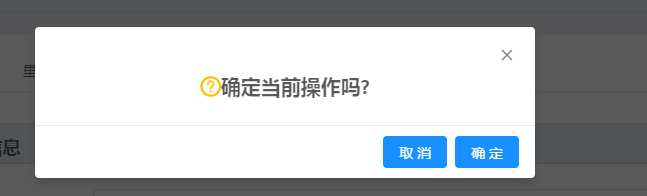

### 模态框的隐藏、关闭和确定




> 当没有设置“maskClosable={false}”时，maskClosable默认属性为true

此时，点击遮罩层、点击“取消”、点击“关闭”，调用的方法都是onCancel方法（没有使用footer属性的情况下）


> 当使用footer属性时，隐藏、取消、确定可以分别调用不同的方法<br/>
[代码](https://github.com/sheenden0722/ReactAntdNotes/blob/master/Modal/hideAndCloseModal/hideAndCloseModal.js)

```
<Modal
    onCancel={() => this.handleModal('close')}
    width={'500px'}
    visible={this.state.modalVisible}
    maskClosable={false}
    footer={[
        <Button
            key="cancel"
            type="primary"
            onClick={() => this.handleModal('cancel')}
        >取消
        </Button>,
        <Button
            key="confirm"
            type="primary"
            onClick={() => this.handleModal('confirm')}
        >确定
        </Button>,
    ]}
>
    <div style={{fontWeight:'bold',fontSize:20,marginTop:20,textAlign:'center'}}>
        <Icon
            type='question-circle-o'
            style={{fontSize:20,color:'#ffbf00'}}
        />
        &nbsp;&nbsp;
        {'确定当前操作吗?'}
    </div>
</Modal>
```

