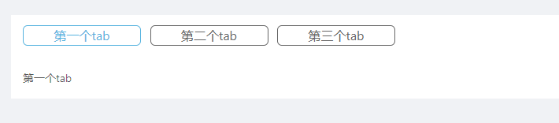

### 圆角矩形tab（自定义组件）

实现圆角tab切换，如下图所示



> **引用squareTab.js组件后，使用如下方式调用**

```
<SquareTab
    activeKey={this.state.tabKey}
    onTabsClick={this.changeTabs}
>
    <div name="第一个tab" num="1">
        {'第一个tab'}
    </div>
    <div name="第二个tab" num="2">
        {'第二个tab'}
    </div>
    <div name="第三个tab" num="3">
        {'第三个tab'}
    </div>
</SquareTab>
```

* 属性说明

**activeKey:**           被激活的tab(子元素的num属性)

**onTabsClick：**     tab点击事件，默认将子元素的num属性作为入参，需要动态改变

​                                this.state.tabKey的值